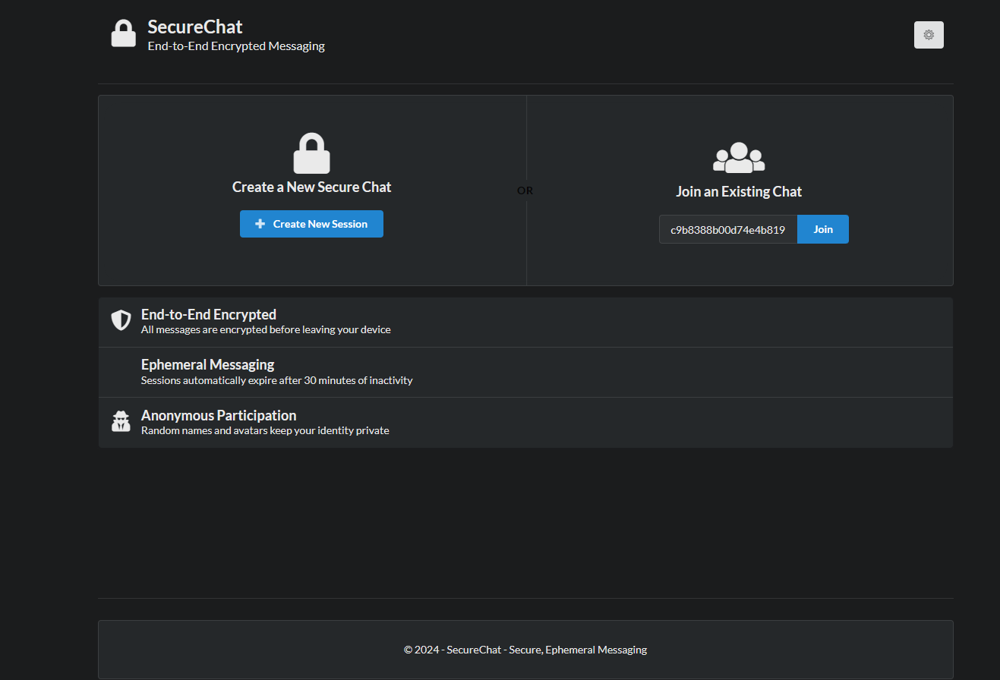
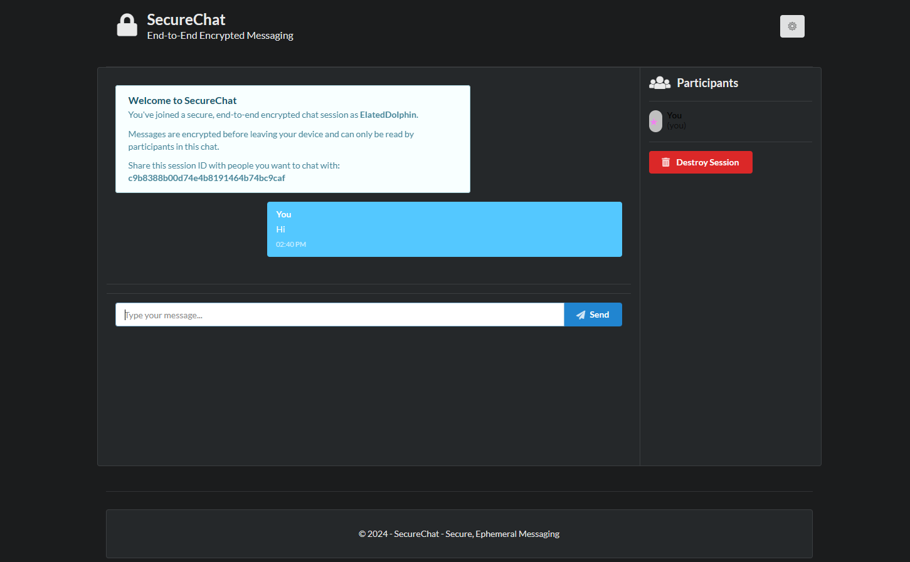

# 🔐 SecureChat

<div align="center">


**An end-to-end encrypted ephemeral messaging platform with zero server knowledge of message content.**

</div>

## 📋 Overview

SecureChat is a secure, ephemeral messaging platform that prioritizes privacy and security. All messages are encrypted end-to-end using the Web Crypto API, ensuring that only the intended recipients can decrypt and read the content. The server never has access to the decryption keys, creating a true zero-knowledge architecture.

## 📷 Screenshots





### ✨ Key Features

- **🔒 End-to-end encryption** using RSA for key exchange and AES-GCM for message content
- **⏳ Ephemeral sessions** that automatically terminate after inactivity or when all users leave
- **🧩 Anonymous participation** with randomly generated names and avatars
- **🌓 Dark/light mode** with system preference detection
- **📱 Responsive design** for seamless use on mobile and desktop
- **🚫 No message persistence** - data exists only in memory and is never stored on the server
- **🔄 Session destruction** that can be triggered by any participant

## 🔍 Security Features

SecureChat implements a hybrid encryption approach:

1. **RSA Key Exchange**:
   - Each participant generates an RSA-2048 key pair when joining
   - Public keys are shared via SignalR to all participants
   - Private keys never leave the client browser

2. **AES Message Encryption**:
   - AES-256-GCM used for actual message encryption
   - New IV (Initialization Vector) generated for each message
   - Session keys securely distributed to all participants

3. **Zero Server Knowledge**:
   - Server only stores session metadata and participant information
   - Messages pass through server only in encrypted form
   - Server cannot decrypt any message content
   - No logs of message content or encryption keys

## 🛠️ Project Setup

### Prerequisites
- [.NET 8.0 SDK](https://dotnet.microsoft.com/download)
- SQL Server (or SQL Server LocalDB which comes with Visual Studio)
- A modern web browser (Chrome, Firefox, Edge, etc.)

### Quick Start

**Windows:**
```bash
# Run the provided setup script
.\run-test.bat
```

**Mac/Linux:**
```bash
# Make the script executable
chmod +x run-test.sh
# Run the script
./run-test.sh
```

### Manual Setup

1. **Create and apply database migrations**

   ```bash
   dotnet ef migrations add InitialCreate
   dotnet ef database update
   ```

2. **Build and run the application**

   ```bash
   dotnet build
   dotnet run
   ```

3. **Access the application**

   Open your browser and navigate to http://localhost:5000

## 📱 Usage Guide

### Creating a New Chat Session

1. Visit the landing page
2. Click "Create New Session"
3. You'll be assigned a random name and avatar
4. Share the session ID with others you want to chat with

### Joining an Existing Session

1. Get the session ID from someone who created a session
2. Enter it on the landing page
3. Click "Join"
4. You'll be assigned a random name and avatar for anonymity

### During the Chat

- Type messages in the input field and press Enter or click Send
- View all participants in the sidebar
- Toggle dark/light mode using the moon/sun icon
- Any participant can destroy the session at any time
- Session automatically terminates after 30 minutes of inactivity

## 🏗️ Project Architecture

The project follows a clean architecture approach with these components:

- **SignalR Hub**: Manages real-time communication between clients
- **Entity Framework Core**: Handles data persistence for sessions and participants
- **Web Crypto API**: Provides client-side encryption capabilities
- **Background Services**: Cleans up inactive sessions automatically
- **MVC Controllers**: Handle session creation and joining
- **Semantic UI**: Provides responsive and themeable UI components

## 📂 Project Structure

```
SecureChat/
├── Controllers/         # MVC controllers for session management
├── Data/                # Database context and configuration
├── Hubs/                # SignalR hub for real-time communication
├── Models/              # Entity models for sessions and participants
├── Services/            # Background services and utilities
├── Views/               # UI templates
│   ├── Home/            # Landing page and chat room views
│   └── Shared/          # Layout templates
└── wwwroot/             # Static assets
    ├── css/             # Stylesheets
    └── js/              # JavaScript files including encryption utilities
```

## 🧪 Testing Instructions

### Testing Features

#### Landing Page
- You should see the landing page with two options: "Create a New Secure Chat" and "Join an Existing Chat"
- Test the dark/light mode toggle by clicking the moon/sun icon in the top right corner

#### Create and Join
1. Create a session in one browser window
2. Open a new browser window or incognito mode
3. Join the session using the ID from the first window
4. Verify that both windows show the chat interface with different random names

#### Chat Room Features
- Send messages between the windows (encrypted end-to-end)
- Observe typing indicators
- Test participant presence awareness
- Try the dark/light mode toggle in the chat interface
- Test the "Destroy Session" feature

## ⚠️ Troubleshooting

If you encounter any issues:

- Ensure the database connection string in `appsettings.json` matches your SQL Server instance
- Check console logs in the browser developer tools (F12) for any JavaScript errors
- Verify that the .NET Core application is running without errors in the console
- Ensure all JavaScript libraries are properly loaded (check Network tab in browser dev tools)

### Common Issues (Fixed)

1. **TaskCanceledException in Background Service**
   - **Symptom**: Error message `System.Threading.Tasks.TaskCanceledException: A task was canceled` when shutting down
   - **Fix**: The service now properly handles cancellation tokens

2. **CORS Configuration Error**
   - **Symptom**: Error message about wildcard origin with credentials
   - **Fix**: Replaced wildcard with specific localhost origins

## 📅 Development Timeline

This project was developed according to a phased approach:

- **Phase 1 (Aug 2024)**: Project setup, database models, basic structure
- **Phase 2 (Sep-Oct 2024)**: Core functionality, SignalR, encryption implementation
- **Phase 3 (Nov-Dec 2024)**: User interface, theming, visual polish
- **Phase 4 (Jan 2025)**: Security enhancements, testing, optimization
- **Phase 5 (Feb 2025)**: Deployment configuration, documentation

## 📜 License

This project is available under the Apache License.

---

<div align="center">
Created with ❤️ for secure and private communication
</div>